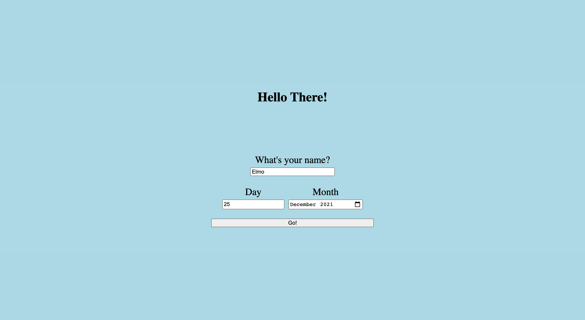

# Birthday Greeter App

 This is a small web app for users to calculate how many days remain until their Birthday.
 If it is a user's birthday, the app will congratulate them on surviving another year.

## Background:

This is a small ruby-based web app. This app was suggested as part of a challenge by Maker's Academy to better familiarise myself with developing web applications using Ruby and Sinatra.

## Instructions:

Clone this repository to your local machine.
You can do this by copying the following command into your command terminal.

```
git clone git@github.com:RTurney/Birthday-app.git
```

Ensure all the required gems are installed:

```
bundle
```

To run the app:
```
rackup
```
And then visit localhost: 9292 in your browser of choice.

You should be met with this page when you run the app correctly:


You can input your name:


And then your birthday:



If your birthday is today (congrats by the way) you should see:


Otherwise you will see how many days left you have to wait:

 

### Wireframe:

Here are the wireframe concepts for this web app.

Main page:


Congratulations page:


Page with days left until your birthday:


### User stories:

```
As an excited child,
So that I can be welcomed to the page,
I would like the page to say hello, when loaded.
```

```
As an excited child,
So that I can be sure it's my birthday I'm checking,
I would like the app to take my name.
```

```
As an excited child,
So that I can count down the days until my birthday,
I would like to be able to put my birthday into the app.
```

```
As an excited child,
So that I can work out how many days are left until my birthday,
I would like the app to tell me how many days are left.
```

```
As an excited child,
So that I can feel special on my special day,
I would like the app to congratulate me if it's my birthday today.
```

### Tests and test coverage:

To run the tests for this app, please run the following line in the command line:
```
rspec
```


At the current version all 9 tests are passing with 100% coverage.
